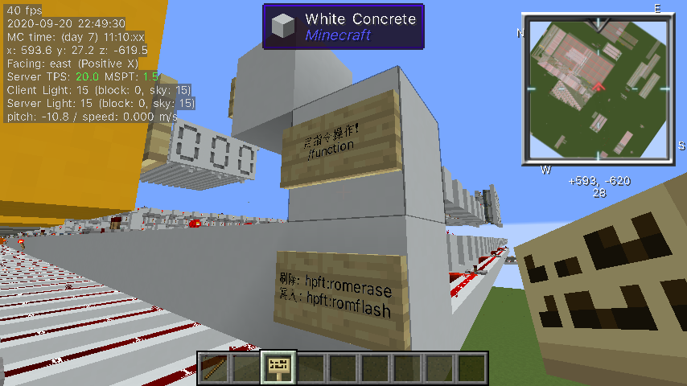
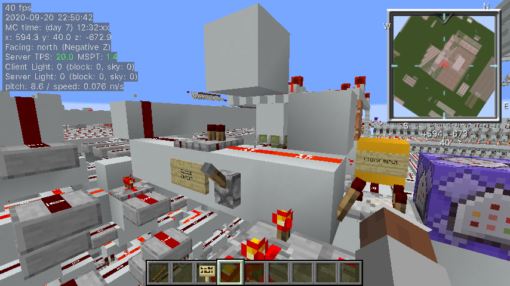

# h831-assembler
Assembler for H831 CPU in Minecraft.

#### Overview

This repository hosts the assembler for H831 CPU in minecraft, which converts the assembly code to native binary file for H831. The compiled binary is expected to be stored in the program ROM (PROM) of the H831 CPU.

Note that the program ROM (PROM) has only 2716b. Make sure the size your compiled program is less than that.

#### Usage

```bash
usage: h8as.py [-h] [-o OUT_FILENAME] IN_FILENAME MAPFILE

positional arguments:
  IN_FILENAME      File for assembly program
  MAPFILE          Microcode descriptor file

optional arguments:
  -h, --help       show this help message and exit
  -o OUT_FILENAME  File for assembler output
```

##### Required arguments

1. `IN_FILENAME`: The program code for H831 in assembly.
2. `MAPFILE`: The Instruction Decode Descriptor file (Since there is no instruction decoder in that CPU)
	- If you download this repository, the `MAPFILE` would be `config/ucode.map`. It is a text file.

##### Optional arguments

- `OUT_FILENAME`: The filename for the compiled binary file.
	- The program will output the binary line-by-line regardless of having this parameter specified.

#### Examples

The following examples assumed that you have changed your working directory to the downloaded repository folder.

```bash
python3 h8as.py demo/memtest.asm config/ucode.map -o memtest.bin
```

```bash
python3 h8as.py demo/15x17.asm config/ucode.map
```

#### Assembly guide

Check out "**h831 Assembly Programming Guide**", or download it in `pdfdocs/h831 Assembly Programming Guide.pdf`.

#### Running on H831

Use `hfpt.py`. 

##### Steps

1. Compile the binary first. Subsititude your filenames in angled brakets.

	```shell
	python3 h8as.py <assembly code file> config/ucode.map -o <binary>
	```

2. Run flash programming tool to generate a mcfunction file, which is used to program the computer easily. You will get a `romflash.mcfunction` file.

	```shell
	python3 hfpt.py <binary>
	```
	
3. Make sure the datapack prototype for hfpt is installed.

4. Subsititude the `romflash.mcfunction` in the datapack. Reload your world using `/reload`.

5. Stand on the programming spot and run these commands

		

	```
	/function hfpt:romerase
	/function hfpt:romflash
	```

6. Your program should be up and running after you have turned on the **PC** (Program counter).

	1. Oscillator (Clock) turned on

		

	2. Program Counter Enabled

		

## Component revisions

| Component              | Revision | Date       |
| ---------------------- | -------- | ---------- |
| Microcode/Pin layout   | dev-a2e  | 2020-09-02 |
| Assembler              | dev-a5e  | 2020-09-05 |
| Flash Programming Tool | dev-a1   | 2020-09-05 |


